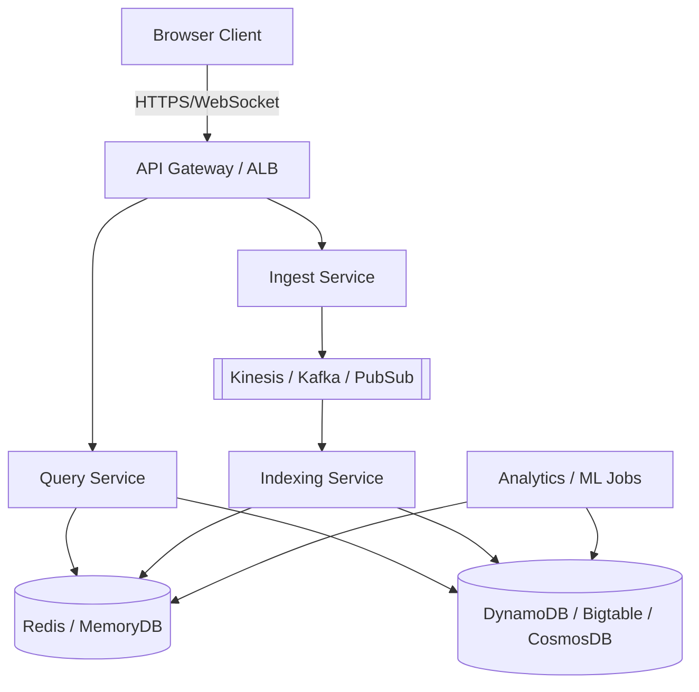
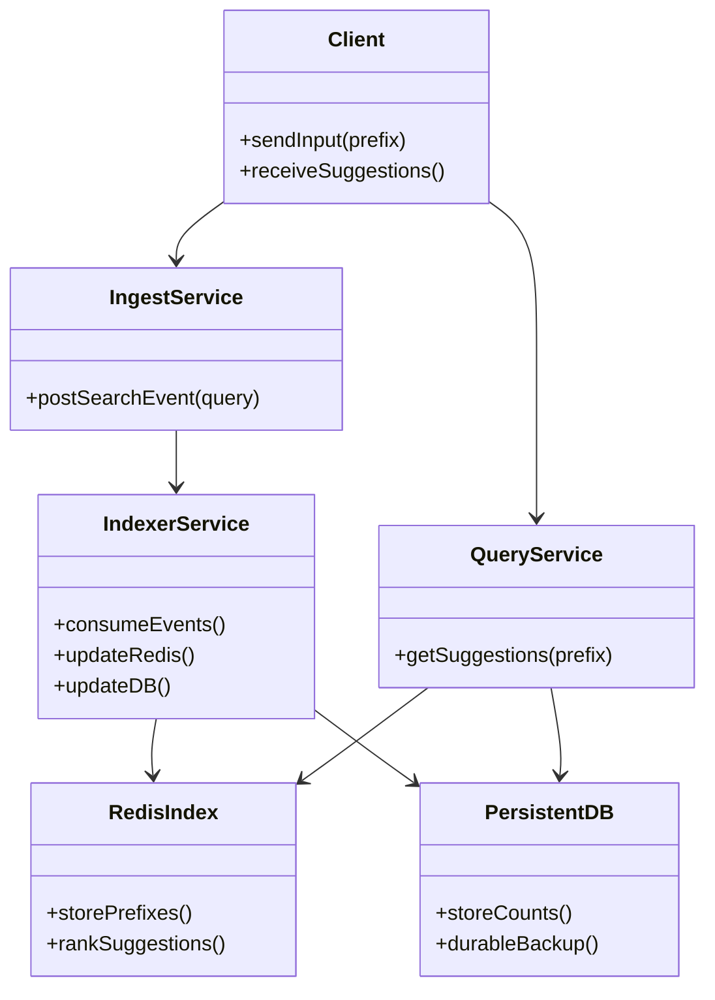
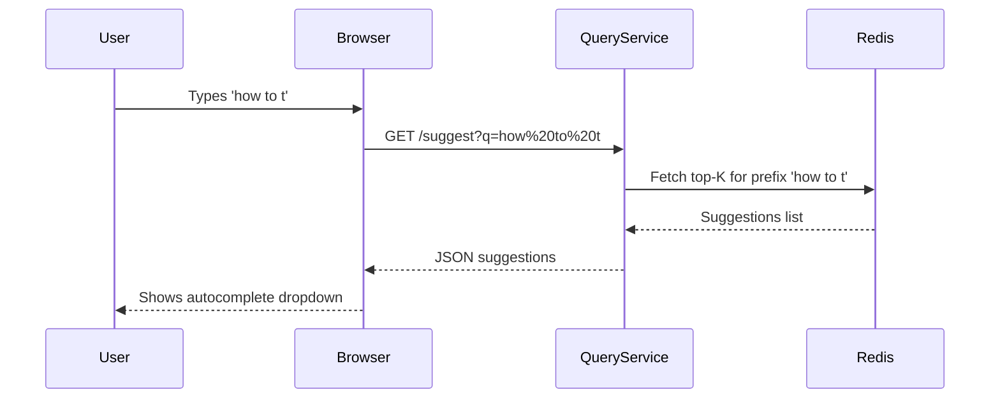

# Autocomplete Search Suggestion System

An **autocomplete system** that dynamically suggests top searched items based on partially typed input. The system ensures **freshness, scalability, and low-latency responses** while handling **high QPS** in real-time.

---

## 🚀 Features

* Real-time autocomplete suggestions.
* Supports high QPS (>1M QPS scale).
* Near real-time ingestion of search queries.
* Prefix and fuzzy matching for partially typed queries.
* Cloud-native (AWS, GCP, Azure ready).
* Microservice architecture for scalability and fault tolerance.
* Browser-accessible (REST API + WebSocket).
* Ranking by frequency, recency, and engagement.
* Extensible to support personalization.

---

## 🏗️ High-Level Architecture



### Components

* **Browser Client**: Web app or mobile browser that fetches suggestions.
* **API Gateway / ALB**: Entry point for client traffic.
* **Query Service**: Returns suggestions from Redis index.
* **Ingest Service**: Receives completed search queries.
* **Streaming Pipeline**: Kinesis / Kafka for ingestion.
* **Indexer Service**: Updates Redis and persistent DB.
* **Persistent Store**: DynamoDB / Bigtable / Cosmos DB for durability.
* **Analytics / ML**: Re-ranking jobs (CTR, personalization).

---

## 📊 UML Component Diagram



---

## 🔑 API Endpoints

### Suggestion API

```http
GET /suggest?q=<query>&limit=10&lang=en&region=IN
```

**Response**:

```json
{
  "q": "how to t",
  "suggestions": [
    { "text": "how to tie a tie", "score": 987.2, "count": 12453 },
    { "text": "how to take a screenshot", "score": 754.1, "count": 8292 }
  ]
}
```

### Ingest API

```http
POST /event/search
{
  "userId": "1234",
  "query": "how to tie a tie",
  "timestamp": "2025-09-18T20:03:12Z"
}
```

---

## ⚙️ Data Flow

1. User types in browser → Query sent to Query Service.
2. Query Service looks up prefix in Redis and returns top suggestions.
3. When user completes a search, Ingest Service records query.
4. Event published to streaming pipeline (Kinesis/Kafka).
5. Indexer consumes events, updates Redis + DynamoDB.
6. Suggestions updated in real-time.

---

## 🔧 Tech Stack

* **Frontend**: Browser app (React/VanillaJS).
* **Gateway**: AWS API Gateway / ALB (or GCP API Gateway / Azure APIM).
* **Microservices**: Containerized (EKS / GKE / AKS or Cloud Run / ECS).
* **Streaming**: Kinesis / Kafka / PubSub / Event Hubs.
* **Index**: Redis / RedisSearch / MemoryDB.
* **DB**: DynamoDB / Bigtable / Cosmos DB.
* **Analytics**: Spark / Flink / Dataflow.
* **Monitoring**: CloudWatch, Prometheus, Grafana.

---

## 📈 Sequence Diagram (Typing a Query)



---

## 🧩 Deployment Checklist

* [x] Provision EKS/ECS/GKE/AKS cluster.
* [x] Deploy Redis cluster (ElastiCache / Memorystore).
* [x] Deploy DynamoDB / Bigtable.
* [x] Setup Kinesis / Kafka stream.
* [x] Implement Query + Ingest + Indexer microservices.
* [x] Add API Gateway with rate-limiting.
* [x] Configure CloudFront CDN for global distribution.
* [x] Add monitoring and alerting.

---

## 📦 Future Enhancements

* Fuzzy/typo-tolerant suggestions.
* Personalized suggestions per user.
* Multi-language support.
* ML-based re-ranking (CTR, embeddings).
* Edge caching with CloudFront + Lambda\@Edge.

---

## 📜 License

MIT License
