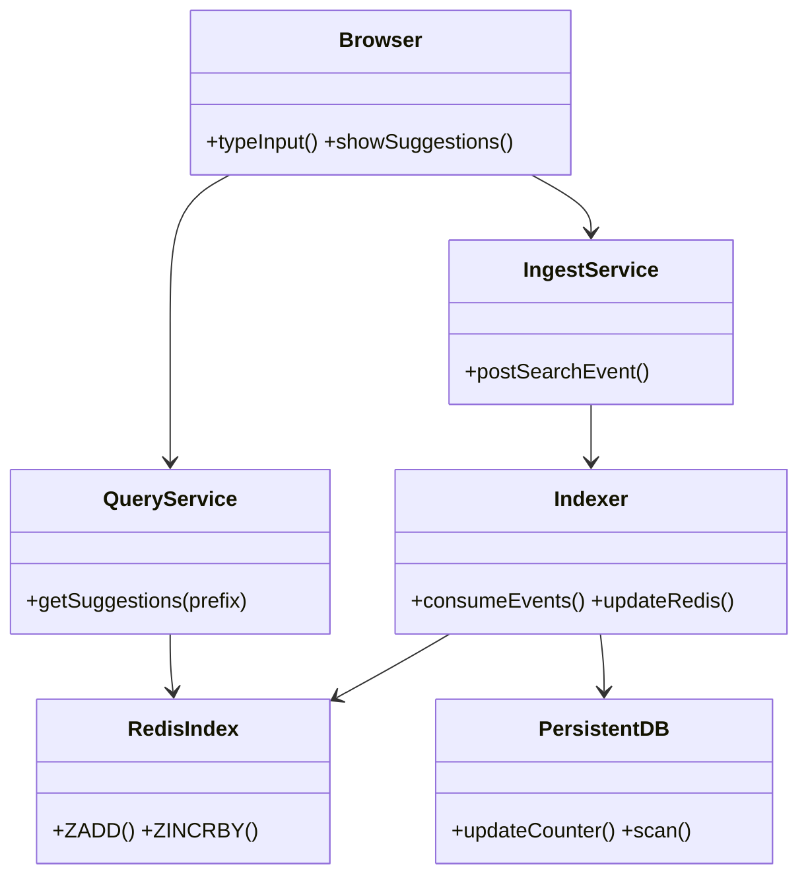
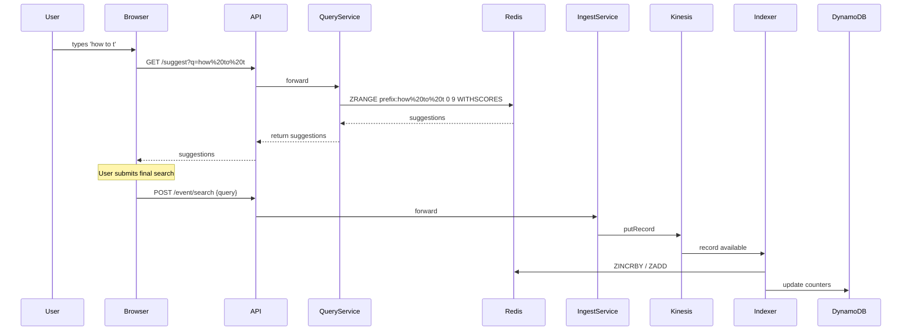

# Autocomplete Search Suggestion System

> Production design for a cloud-hosted, microservice-based autocomplete system that provides low-latency, near-real-time suggestions for partially typed user input. Built to scale to high QPS while keeping suggestion data fresh and relevant.

---

## Table of Contents

1. Goals & Constraints
2. Executive Summary
3. High-level Architecture (AWS concrete components + GCP/Azure equivalents)
4. Core Components
5. Data Model & Index Design
6. Ranking & Scoring
7. Ingestion & Freshness (near-real-time pipeline)
8. Query Path (user typing → suggestions)
9. Misspellings & Fuzzy Matching
10. Sharding, Partitioning & Scaling to High QPS
11. Consistency, Correctness & Idempotency
12. Monitoring, Logging & Observability
13. Security, Privacy & Compliance
14. Offline / ML Re-ranking
15. Deployment, CI/CD & Runbook
16. Cost Considerations
17. Example APIs
18. Implementation Notes & Tradeoffs
19. Short Deployment Checklist
20. Minimal End-to-End Workflow
21. Architecture diagrams / UML (multiple views)
22. Appendix: Redis / DynamoDB key schemas + sample commands
23. Next steps & Offerings

---

## 1. Goals & Constraints

* **Latency target:** p95 < 50ms for suggest queries.
* **Freshness:** new searches reflected in suggestions within **seconds** (near-real-time).
* **Throughput:** design for hundreds of thousands QPS (optionally 1M QPS via horizontal scale).
* **Accuracy:** good prefix, fuzzy, and token-aware matches; ranking prioritized by frequency and recency.
* **Availability:** 99.99% SLA objective for suggestion reads.
* **Global access:** browser client from any device.

---

## 2. Executive Summary

This system combines a low-latency in-memory prefix index (Redis/MemoryDB + RedisSearch) for reads with an asynchronous streaming ingestion pipeline (Kinesis/Kafka) and a persistent store (DynamoDB/Bigtable) for durability and analysis. The system keeps top-K suggestions precomputed per prefix and updates those sorted sets incrementally as users submit searches. Offline ML jobs produce re-ranked top-K snapshots to push atomically for major updates.

---

## 3. High-level Architecture (AWS concrete components)

```mermaid
flowchart LR
  subgraph ClientLayer
    A[Browser Client<br/>(React / Web)]
  end

  subgraph Edge
    CF[CloudFront CDN] --> AGW[API Gateway / ALB]
  end

  AGW --> QS[Query Service (EKS/ECS)]
  AGW --> IS[Ingest Service (EKS/ECS)]
  QS --> REDIS[(ElastiCache / MemoryDB Redis Cluster)]
  QS --> DDB[(DynamoDB / Aurora)]
  IS --> K[Amazon Kinesis / MSK Kafka]
  K --> IDX[Indexers (EKS/ Lambda Consumers)]
  IDX --> REDIS
  IDX --> DDB
  Analytics[Analytics & ML Jobs (EMR / Glue / Dataflow)] --> DDB
  Analytics --> S3[Bucket (Model & Bulk Index snapshots)]

  subgraph Observability
    Xray[AWS X-Ray]
    CW[CloudWatch]
  end

  QS --> Xray
  IS --> Xray
  IDX --> Xray
  QS --> CW
  IS --> CW
  IDX --> CW
```

**GCP equivalents:** Cloud CDN + Cloud Run/GKE, Pub/Sub, Memorystore, Bigtable/Firestore.
**Azure equivalents:** Azure Front Door, App Services/AKS, Event Hubs, Azure Cache for Redis, Cosmos DB.

---

## 4. Core Components

* **Browser Client**: Debounced suggestion requests, posts final search events to ingest API.
* **API Gateway / ALB**: Rate-limiting, auth, ingress.
* **Query Microservice**: Stateless service that looks up Redis prefixes and returns suggestions (supports JSON + HTTP/2 + gRPC internally).
* **Ingest Microservice**: Validates and publishes completed search events to Kinesis/Kafka.
* **Indexer**: Consumes the stream, computes prefix updates, updates Redis and durable DB.
* **Redis Index (in-memory)**: Holds top-K per prefix as sorted sets or RedisSearch indexes for fast top results.
* **Persistent Store**: DynamoDB for counts, frequency and metadata, used for rebuilds and analytics.
* **Analytics / ML**: Offline re-ranking and model training.
* **Monitoring & Alerts**: CloudWatch/Prometheus + Grafana + X-Ray.

---

## 5. Data Model & Index Design

**Suggestion item (DynamoDB row)**

```json
{
  "query": "how to tie a tie",
  "normalized": "how to tie a tie",
  "count": 12453,
  "score": 987.2,
  "lastSeen": "2025-09-18T20:03:12Z",
  "language":"en",
  "region":"IN"
}
```

### Two-layer index:

1. **Redis in-memory prefix index** — primary read path. Keys like `prefix:{lang}:{region}:{prefix_text}` map to a sorted set of suggestion ids (or suggestion text) scored by ranking score. This gives O(logN) operations to retrieve top-K.
2. **DynamoDB persistent store** — durable counters, lastSeen, and metadata used by offline jobs and bulk rebuild.

### Prefix granularity

* Generate prefixes for full query up to `max_prefix_chars` (e.g., 50) or until token boundary rules.
* Optionally token-prefix strategy: index prefixes of tokens (first-token prefixes + subsequent token prefixes) to reduce explosion for long queries.

### Redis mechanics (example)

* On index update: `ZINCRBY prefix:how 1 "how to tie a tie"` (or better: `ZADD` with new score then trim).
* Trim top-K: `ZREMRANGEBYRANK prefix:how 0 -201` to keep top 200.
* Use `ZPOPMIN` or `ZREMRANGEBYRANK` for eviction logic.

---

## 6. Ranking & Scoring

Combine frequency, recency, and engagement into a single ranking score.

**Example formula**

```
score = α * log(1 + freq) + β * recency_decay(lastSeen) + γ * click_score + δ * personalization_boost
```

* `recency_decay(t) = exp(-(now - t) / τ)`
* Tune α..δ offline; use A/B tests and holdout sets.
* Store derived score in Redis (score used by sorted set) so reads are cheap.

---

## 7. Ingestion & Freshness (near-real-time pipeline)

**Flow:**

1. Client posts completed search: `POST /event/search`.
2. Ingest service normalizes + validates and publishes event to Kinesis (or Kafka).
3. Indexer consumers pick up events; for each query:

   * Normalize & compute prefixes.
   * Compute delta score (e.g., +1 frequency, recency weighting) and update Redis sorted sets via `ZINCRBY`/`ZADD`.
   * Batch write durable counters to DynamoDB (use conditional updates or atomic counters).
4. New suggestions visible on Redis in sub-seconds to seconds depending on pipeline latency.

**Optimization**

* Batch updates to Redis to reduce network overhead.
* Use local buffering in indexer with flush thresholds (size/time).
* Optionally update Redis synchronously for ultra-low-latency but pay cost in request latency and throughput.

---

## 8. Query Path

1. Browser types → debounced `GET /suggest?q=...`.
2. API Gateway -> Query service.
3. Query service normalizes input and computes the canonical prefix lookup key.
4. Query service reads `ZRANGE prefix:key 0 limit -1 WITHSCORES` from Redis.
5. If results < limit, fallback to RedisSearch/Elasticsearch full-text query or persistent DB.
6. Return JSON results.

**Client best practices**

* Debounce 100–200ms.
* Cancel in-flight requests for previous keystrokes.
* Render quickly; show loading state for slow responses.

---

## 9. Misspellings & Fuzzy Matching

Options (in increasing cost):

* **Edge n-gram / prefix matching** in RedisSearch or OpenSearch.
* **Fuzzy queries (Levenshtein)** with RedisSearch or Elasticsearch for minor typos.
* **Character n-grams / phonetic algorithms** for languages with complex orthography.
* **Fallback strategy**: only run fuzzy search if exact-prefix returns < limit.

Tradeoffs: fuzzy increases memory and CPU. Use heuristics (min query length, rare fallback) to limit cost.

---

## 10. Sharding, Partitioning & Scaling

* **Redis Cluster** (sharded by key) for horizontal scaling of prefix keys.
* **Partition streaming** (Kinesis shards or Kafka partitions) for ingest throughput.
* **Indexers**: horizontally scaled consumers pinned to partitions.
* **Query service**: autoscaled pods behind ALB.

**Partitioning strategy**

* Hash prefix keys (first 1–3 characters or a stable hash) to maintain related prefixes in the same shard.
* Use consistent hashing for even distribution.

**Hot keys mitigation**

* Replicate ultra-hot prefixes into a small read-only cache layer or push to CDN (CloudFront) with short TTL.
* Apply adaptive throttling for hot prefixes (sample user updates rather than indexing every single one) if ingestion saturates.

---

## 11. Consistency, Correctness & Idempotency

* System is **eventually consistent** — target near-real-time visibility.
* Use **idempotent events** (unique event IDs) in the stream to deduplicate updates.
* Use sequence numbers/timestamps to prevent out-of-order stale writes from lowering scores incorrectly.
* Periodic reconciliation job: rebuild top-K from persistent counts to restore consistency.

---

## 12. Monitoring, Logging & Observability

**Metrics to track:**

* Suggest API latency p50/p95/p99.
* QPS (suggest requests/sec), QPS (ingest events/sec).
* Redis commands/sec, memory usage, eviction rate.
* Kinesis / Kafka consumer lag.
* Indexer throughput and error rate.

**Tools:** CloudWatch/X-Ray or Prometheus/Grafana, ELK/OpenSearch for logs.

---

## 13. Security, Privacy & Compliance

* TLS for all endpoints.
* API Gateway enables rate-limiting and simple auth.
* JWT-based auth for personalization endpoints.
* Data retention policies and user opt-out/delete endpoints to comply with GDPR.
* Audit logs for admin APIs and model changes.

---

## 14. Offline / ML Re-ranking

* Periodic batch jobs (Spark/Flink/Dataproc) compute improved ranking using CTR, embeddings, business rules.
* Produce bulk top-K per prefix snapshots and push to Redis in an **atomic namespace swap** (write to `prefix_v2:*` then cutover to `prefix_v1` name).
* Use offline evaluation + shadow traffic before promoting models to production.

---

## 15. Deployment, CI/CD & Runbook

* **CI:** GitHub Actions / CodeBuild to build and test images.
* **CD:** Deploy via ArgoCD, Helm, or CodeDeploy for EKS/ECS.
* **Canary & A/B:** use traffic splitters (ALB rules or feature flags).
* **Runbook examples:** restore Redis snapshot, throttle ingest producers, rebuild index from DB.

---

## 16. Cost Considerations

* Largest costs: Redis cluster memory and Kinesis/Kafka throughput.
* DynamoDB costs for write-heavy counters — consider provisioned with autoscaling.
* Edge caching reduces reads and cost for hot prefixes.

---

## 17. Example API Definitions

### GET /suggest

```
GET /suggest?q=how%20to%20t&limit=10&lang=en&region=IN
```

**Response**

```json
{ "q":"how to t", "suggestions": [{"text":"how to tie a tie","score":987.2,"count":12453} ] }
```

### POST /event/search

```
POST /event/search
{ "userId":"u123","query":"how to tie a tie","timestamp":"2025-09-18T20:03:12Z","eventId":"uuid-..." }
```

---

## 18. Implementation Notes & Tradeoffs

* **Trie**: ultra-fast prefix lookup but complex to distribute and persist. Good for single-node extreme latency requirements.
* **Redis Sorted Sets per-prefix**: pragmatic, horizontally shardable, good memory/latency tradeoff.
* **OpenSearch/Elasticsearch**: rich features (fuzzy, ngram) but higher latency and resource cost. Use as fallback or for fuzzy/autocomplete heavy use-cases.
* **Sync updates vs streaming async**: synchronous updates ensure immediate consistency but reduce ingest throughput and increase producer latency. Streaming gives near-real-time visibility with much higher throughput.

---

## 19. Short Deployment Checklist

1. VPC + networking + IAM.
2. EKS / ECS / GKE cluster + nodegroups.
3. ElastiCache / MemoryDB Redis (cluster-mode) + parameter tuning.
4. DynamoDB table(s) for durable counts.
5. Kinesis stream or MSK cluster.
6. Deploy Query Service, Ingest Service, Indexers.
7. CloudFront + API Gateway/ALB.
8. Observability (Prometheus/Grafana or CloudWatch).
9. CI/CD pipelines and canary rules.
10. Backup & DR plan.

---

## 20. Minimal End-to-End Workflow (concrete)

* User types → front-end calls `GET /suggest` (Redis read).
* User selects or submits search → front-end calls `POST /event/search`.
* Ingest service publishes to Kinesis.
* Indexer consumes, updates Redis & DynamoDB.
* Suggestion list reflects update within seconds.

---

## 21. Architecture diagrams & UML (multiple views)

**Mermaid: high-level architecture (already above).**

### Class diagram



### Sequence diagram (full pipeline)



### Deployment view (component-to-AWS)

```mermaid
flowchart TB
  subgraph Region[aws-region]
    ALB[ALB/API Gateway]
    ALB --> ASG[QueryService (EKS Pods)]
    ALB --> ASG2[IngestService (EKS Pods)]
    ASG --> Redis
    ASG --> DynamoDB
    ASG2 --> Kinesis
    Kinesis --> IndexerPods
    IndexerPods --> Redis
    IndexerPods --> DynamoDB
    CloudFront --> ALB
  end
```

---

## 22. Appendix: Redis / DynamoDB key schemas + sample commands

**Redis keys**

* `prefix:{lang}:{region}:{prefix}` — sorted set of suggestions (member = suggestion text or id, score = ranking score)
* `suggestion:{id}` — optional hash with metadata

**Sample Redis commands**

```text
# Incremental update
ZINCRBY prefix:en:IN:how 1 "how to tie a tie"
# Keep top-200
ZREMRANGEBYRANK prefix:en:IN:how 0 -201
# Read top-10
ZRANGE prefix:en:IN:how 0 9 WITHSCORES
```

**DynamoDB table** `Suggestions`

* Partition key: `normalized_query` (string)
* Attributes: `count` (number), `lastSeen` (ISO timestamp), `score` (number), `language`, `region`
* Use UpdateItem with `ADD` for counters.

---

## 23. Next steps & Offerings

Choose what you'd like me to produce next (I can generate instantly here):

* A Terraform manifest / CDK stack for core infra (EKS, ElastiCache, DynamoDB, Kinesis).
* Sample microservices: Node.js or Go implementations for Query Service and Indexer (with README + tests).
* A minimal React client UI that demonstrates typing + suggestions + event posting.
* A short cost estimate for a target QPS and region.
* A step-by-step runbook for handling hot-key spikes and disaster recovery.

---

**License:** MIT

**Author:** Autocomplete Design — generated by ChatGPT (assistive design)
