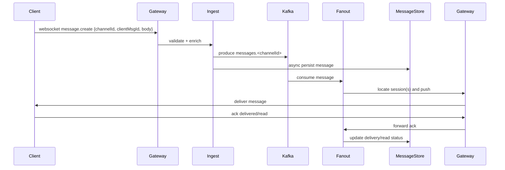
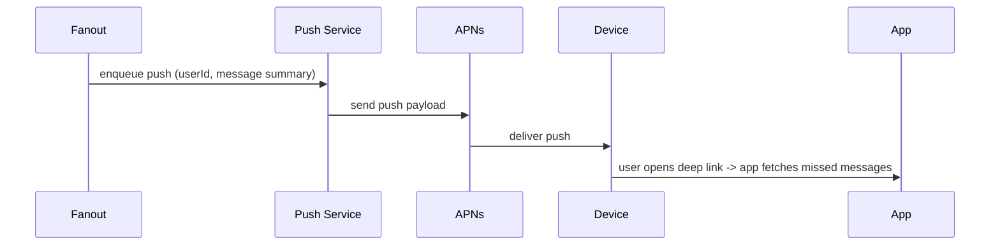
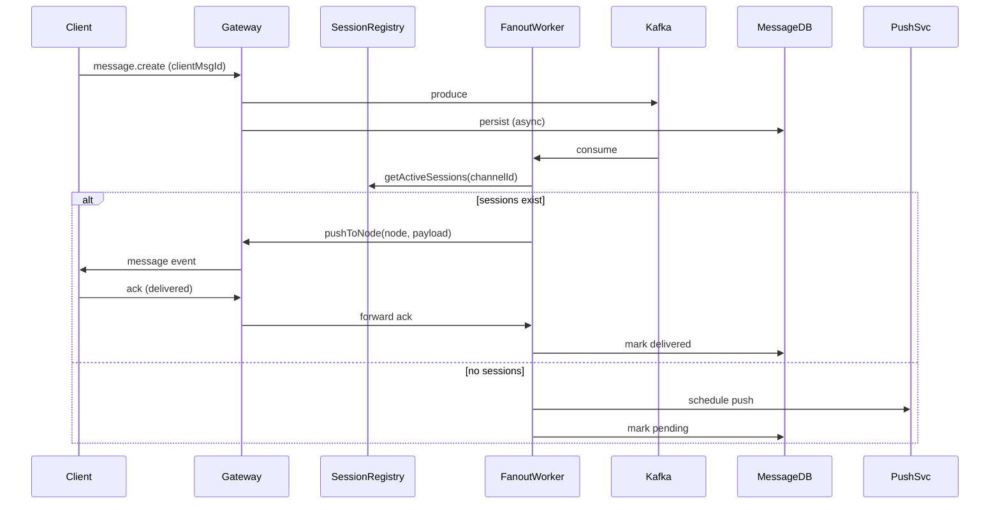

# Real-time Notification System


> A scalable, production-ready design for a real-time notification / messaging system (Slack / Facebook Messenger style). Includes connection gateways, durable messaging backbone, fanout workers, presence, push notifications, and persistence.

---

## Table of contents

* [Project Overview](#project-overview)
* [Key Features](#key-features)
* [High-level Architecture](#high-level-architecture)
* [Data Flow Diagrams](#data-flow-diagrams)

  * [Client → Gateway → Ingest → Kafka → Fanout → Client](#client--gateway--ingest--kafka--fanout--client)
  * [Presence & Typing Flow](#presence--typing-flow)
  * [Push Notification Flow](#push-notification-flow)
  * [Sequence Diagram: Message Delivery](#sequence-diagram-message-delivery)
* [Components & Responsibilities](#components--responsibilities)
* [Data Models](#data-models)
* [APIs & WebSocket Events](#apis--websocket-events)
* [Deployment & Scaling](#deployment--scaling)
* [Operational Considerations](#operational-considerations)
* [Quickstart / Developer Notes](#quickstart--developer-notes)
* [Roadmap & Next Steps](#roadmap--next-steps)
* [Contributing](#contributing)
* [License](#license)

---

## Project Overview

This repository contains design artifacts, diagrams, and implementation guidance for building a real-time notification system that supports:

* WebSocket / gRPC streaming for real-time messaging
* Durable, ordered message delivery per channel
* Presence and typing indicators
* Push notifications (APNs/FCM) for offline devices
* Scalable fanout using a partitioned pub/sub backbone (Kafka/Pulsar)
* Persistence and search of message history

Use this as the canonical design and reference when implementing the system components (Gateway, Ingest, Fanout Worker, Push Worker, Presence Service, Message Store, and Search Indexer).

---

## Key Features

* Low-latency delivery (target median < 200ms)
* At-least-once delivery with client-side deduplication (idempotency tokens)
* Per-channel ordering guarantees (configurable)
* Efficient offline handling & push aggregation
* Region-aware deployment & cross-region federation
* Observability: metrics, tracing, logs

---

## High-level Architecture

```mermaid
flowchart LR
  subgraph Clients
    C[Web & Mobile Clients]
  end
  C -->|WS/gRPC| LB[Load Balancer]
  LB --> GW[WebSocket Gateway]
  GW -->|Validate + Forward| Ingest[Ingest Service]
  Ingest -->|Produce| Kafka[(Kafka / PubSub)]
  Kafka --> Fanout[Fanout/Delivery Workers]
  Fanout -->GW
  Fanout --> Push[Push Service]
  Ingest --> DB[(Message Store: Cassandra/DynamoDB)]
  Ingest --> Index[Search Index (Elastic)]
  Push --> APNs[APNs/FCM]
  subgraph Aux
    Auth[Auth Service]
    Redis[Redis Session Registry]
    S3[Attachment Storage (S3)]
  end
  GW --- Redis
  GW --- Auth
  Ingest --- S3
```

---

## Data Flow Diagrams

### Client → Gateway → Ingest → Kafka → Fanout → Client



### Presence & Typing Flow

```mermaid
flowchart LR
  Client -->|presence update| GW
  GW --> Redis[Session Registry / Presence (Redis)]
  GW --> Pub[Pub/Sub Presence Topic]
  Pub --> SubscribedClients[Other Gateways -> Clients]
  SubscribedClients --> Clients
```

### Push Notification Flow



### Sequence Diagram: Message Delivery (detailed)



---

## Components & Responsibilities

* **Clients**: handle UI, local storage, reconnect/resume, idempotency.
* **Gateway (WebSocket/gRPC)**: session lifecycle, auth, subscription management, heartbeat.
* **Ingest Service**: validate, enrich, persist, and publish messages to Kafka.
* **Kafka (Pub/Sub)**: ordered, partitioned durable log for fanout and replay.
* **Fanout Workers**: consume, determine recipients, push to connected sessions or push queue.
* **Session Registry (Redis)**: track active sessions and gateway node mappings.
* **Message Store**: durable storage of messages (read-optimized for channel timeline reads).
* **Push Service**: transform to APNs/FCM payloads respecting user settings.
* **Search Indexer**: asynchronously index message text for search.
* **Auth & Rate-limiter**: authn/authz and abuse protection.

---

## Data Models (short)

* **User**: `{ id, displayName, pushTokens[], settings }`
* **Channel**: `{ id, type, name, members[] }`
* **Message**: `{ id, clientMsgId, channelId, senderId, ts, body, attachments[] }`
* **Delivery**: `{ messageId, recipientId, deliveredAt, readAt }`

---

## APIs & WebSocket Events

**HTTP (REST)**

* `POST /v1/auth/login` -> { token }
* `GET /v1/channels/:id/history` -> paginated messages
* `POST /v1/channels/:id/messages` -> send message (for clients that prefer REST)
* `PATCH /v1/messages/:id/read` -> mark read

**WebSocket Events (JSON)**

* `connect` `{ token, resumeToken }`
* `subscribe` `{ channelId }`
* `message.create` `{ channelId, clientMsgId, body }`
* `message` (server -> client)
* `message.ack` `{ messageId, status }`
* `presence.update` `{ status }`

---

## Deployment & Scaling

* **Gateways**: autoscale behind LB; typical node handles tens of thousands of sockets. Use horizontal scaling and limit per-node sockets.
* **Kafka**: partition count aligned with expected parallelism; monitor consumer lag.
* **Fanout Workers**: scale by consumer groups; use partition assignment to distribute channels.
* **Session Registry**: Redis cluster with sharding for scale.
* **Message Store**: Choose Cassandra / DynamoDB for write-heavy workloads.
* **Regions**: deploy in multiple regions and federate global channels via cross-region replication.

---

## Operational Considerations

* **Monitoring**: connection counts, send->deliver latencies, p99/p50, consumer lag, push success rates.
* **Tracing**: trace message lifecycle for debugging (messageId as trace tag).
* **Backpressure**: gateways should reject high-rate clients; apply per-user rate limits.
* **Graceful Degradation**: if Kafka  is down, gateways buffer limited messages on-disk; reject if buffers reach limit.

---

## Quickstart / Developer Notes

1. Clone repository
2. Start locally: optionally run a minimal Gateway + Ingest + In-memory Fanout (MVP mode)
3. Configure environment with `KAFKA_BOOTSTRAP`, `REDIS_URL`, `MESSAGE_DB_URL`, `APNS_KEY`, `FCM_KEY`.
4. Use sample client (provided in `/examples`) to establish a WebSocket and test message flow.

---

## Roadmap & Next Steps

* Provide production-ready Gateway microservice (Node/Go) with Helm chart.
* Implement fanout worker templates and consumer-sharding utilities.
* Add E2E encryption support for selective channels.
* Provide a test harness to simulate scale (connections/messages/sec).
